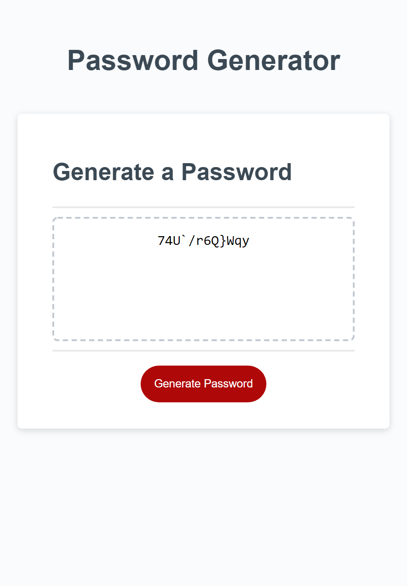

# Password Generator 

## Description
This website is designed to generate a random password with a character length between 8 and 128 as specified by the user. 

The website user can also specify if the password will contain lowercase letters, capital letters, numbers, special characters, or a combination of these options.

This website serves as a submission to an assignment testing skills in JavaScript with features such as loops, conditionals, functions, arrays, and strings.

## Built With
* Html
* CSS
* JavaScript

## Website Link
https://mazattack1999.github.io/password-generator/

## Contribution
JavaScript password generation functionality contributions by Micah Zahn

## Screenshot
